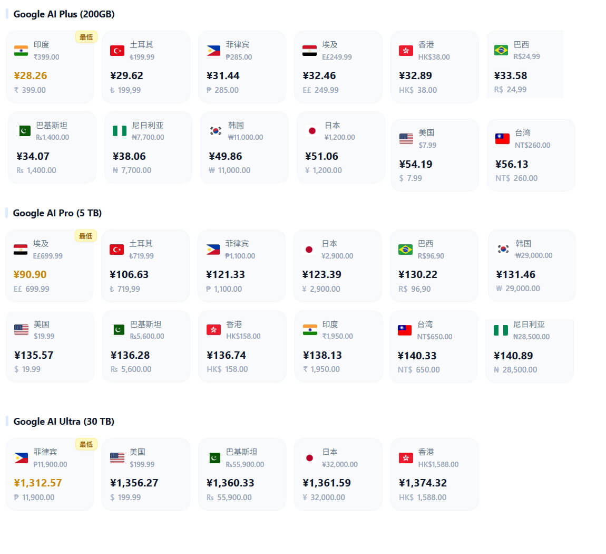
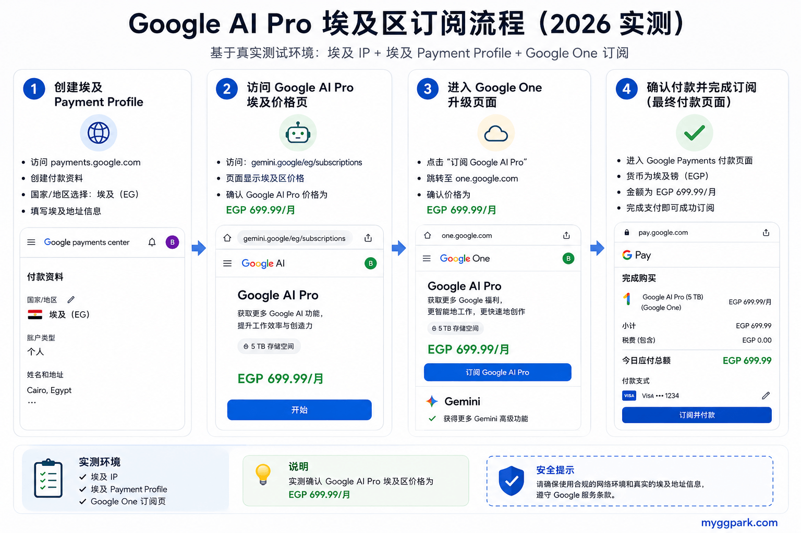
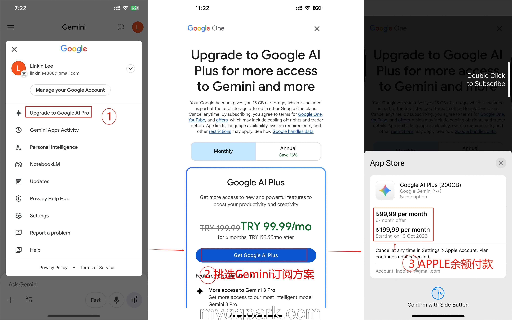

# Google AI Pro 各国价格汇总（2026）：哪个国家最便宜？各国价格对比一览

## 前言：为什么越来越多人开始关注 Google AI Pro 的地区价格？

自从 Google 将 Gemini Advanced 整合进 Google AI Pro（原 Google One AI Premium）之后，越来越多用户开始尝试订阅 Google AI 服务。

但在过去几个月帮助客户处理 Google AI Pro 订阅时，我发现很多人都会问同一个问题：

> 为什么网上有人说 90 元一个月，有人说 145 元一个月？

后来我专门整理了各国价格，才发现 Gemini 并不是全球统一定价，而是会根据国家、税率和市场策略进行调整。

例如：

| 国家/地区 | 价格           | 折合人民币     |
| ----- | ------------ | --------- |
| 美国    | 19.99 美元/月   | 约 136 RMB |
| 香港    | 158 HKD/月    | 约 137 RMB |
| 土耳其   | 719.99 TRY/月 | 约 106 RMB |

部分国家甚至存在长期优惠活动（例如首月免费或连续数月低价）。

因此我整理出本文，希望帮助中国用户了解全球价格差异，选择最适合自己的订阅方案。

---

## Google AI Pro 是什么？

Google AI Pro 是 Google 当前面向个人用户推出的 AI 订阅服务。

它实际上就是此前 Google One AI Premium 的升级命名版本。

Google 近年来逐步将 Google One AI Premium 体系升级为 Google AI Pro 品牌，并持续调整套餐名称与权益结构，但核心权益保持一致。

订阅后通常可以获得：

* Gemini 高级模型权限
* Deep Research 深度研究
* Veo 视频与图像生成能力
* NotebookLM AI 笔记
* Gmail / Docs / Sheets AI 集成
* 2TB Google One 云存储

简单理解：

Google AI Pro 相当于将 ChatGPT Plus、Midjourney AI、Notion AI 与云存储服务整合到同一个生态中。

---

## Google AI Pro 官方价格是多少？

目前（2026 年）官方标准定价如下：

| 套餐              | 价格        | 说明  |
| --------------- | --------- | --- |
| Google AI Plus  | $7.99/月   | 轻量版 |
| Google AI Pro   | $19.99/月  | 标准版 |
| Google AI Ultra | $249.99/月 | 顶级版 |

主流情况：

* 首月通常免费试用
* 年付约 $199（部分地区优惠至 $99）

不过实际付款价格会根据地区、汇率、税费以及 Google 本地化策略产生变化。

---

## Google AI Pro 价格汇总（2026/05/30）

以下价格为公开资料整理，仅供参考。

### Google AI Pro 官方价格表

### 价格解读

Google Gemini 当前页面聚合了各地区可见的应用价格与内购价格。

若同一项目在不同国家或地区出现明显差价，通常与以下因素有关：

* 地区定价梯度
* 汇率波动
* 当地税费
* 市场策略

目前可见：

* Google AI Plus 最低价：印度
* Google AI Pro 最低价：埃及
* Google AI Ultra 最低价：菲律宾

需要注意：

Google 会根据当地经济水平、税率以及市场策略动态调整价格，因此最低价格地区并非长期固定不变。

---

## 为什么不同国家价格差距这么大？

### 1. 地区定价策略（Geo Pricing）

Google 与 Netflix、Spotify、YouTube Premium 一样，会根据不同国家收入水平、消费能力制定不同价格。

### 2. 汇率波动

部分国家货币波动较大，例如：

* 阿根廷比索
* 土耳其里拉

即使官方价格没有调整，换算成人民币后也会产生明显差异。

### 3. 税费机制不同

欧洲、日本等地区通常会包含消费税。

而美国很多州则采用后续税费计算方式。

### 4. 市场推广策略

Google AI 目前仍处于全球推广阶段。

某些国家可能会获得：

* 首月免费
* 半价优惠
* 学生优惠
* 年付折扣

因此实际支付金额可能低于官方定价。

---

## Google AI Pro 最低价地区推荐（2026）

根据目前公开价格整理：

相对低价地区主要集中在：

* 埃及
* 菲律宾
* 土耳其（波动较大）

但需要注意：

价格便宜并不代表一定适合中国用户。

因为Google 近两年持续加强：

* 支付资料验证
* 地区一致性检测
* Google Payment Profile风控

因此：

很多用户最后会发现，

真正影响订阅成功率的并不是便宜10元还是20 元。

而是：

能否稳定完成付款并长期使用。

因此如果一定要我推荐某个低价区订阅的话，我会比较推荐土耳其地区，虽然这个地区的价格不是最低的，但它的支付体系比较成熟，订阅Google AI Plus/Pro价格也比较有优势而且能稳定完成付款。

---

## 如何低价订阅 Google AI Pro

### 方法1：官方低价区订阅（直接）

示例： **埃及**低价区

核心条件：

1、埃及家庭静态注册IP+指纹浏览器搭配支付环境

2、设置Google Payment的支付国家在埃及

 【**推荐阅读**】：
[比特指纹浏览器详细使用教程](https://www.myggpark.com/digital-migration/cross-border-tools/956.html)（文章PIA S5 Proxy IP代理已经过期，换成别的代理即可）

订阅流程：

* 前往[**Google AI官网**](https://gemini.google/)
* 点击订阅Google AI Pro方案
* 输入信用卡资料以及当地的地址和邮政编码区号。

你可以使用网上提供的[**地址自动生成器**](https://cn.americaaddress.com/egypt-address/)来获取相应地区的地址和邮政编码。

完成订阅后，Google将每月从你的信用卡中自动扣款。

如果自己操作困难，可通过[**代订服务**](https://www.guokezhihui.com/buy/183)完成。

### 方法2：App Store低价区iOS内购（推荐）

虽然Gemini订阅最便宜地区是埃及，但埃及低价区的苹果礼品卡我没有正规礼品卡购买渠道，所以我的经验是：优先选择“ **土耳其**”地区 ID。它不仅很多App价格常年位居全球前二，而且我可以推荐正规土耳其礼品卡正规购买渠道：

核心条件：

[**土耳其Apple ID**](https://www.myggpark.com/digital-migration/cross-border-tools/956.html)
 
 [**土耳其苹果礼品卡**](https://www.edigitalchoice.com/buy/51)充值

订阅流程：

* 土耳其Apple ID登录App Store;
* 购买土耳其礼品卡并充值；
* 下载Gemini App并登录；
* 点击订阅Google AI Pro方案；
* 利用App Store余额付款并订阅。

### 方法3：Pixel免费计划（隐藏福利）

除了直接付费订阅低价地区之外，Google 近两年还开始将Google AI Pro 作为 Pixel 高端机型的附赠权益。

根据 Google 官方说明，部分Pixel Pro 系列机型在激活后，可以获得最长 12 个月的 Google AI Pro 免费试用资格。

例如：

Pixel 10 Pro

Pixel 10 Pro XL

Pixel 10 Pro Fold

Pixel Pro系列机型可获得 Google AI Pro 试用权益。具体机型、试用时长及地区政策请以 Google 官方活动页面为准。

这个试用权益指部分地区用户在Pixel 设备激活后，可在Gemini App或 Google One App内免费领取Google AI Pro一年会员。

具体可参考官方资料： [**Pixel设备专属的Google One 优惠**](https://support.google.com/gemini/answer/13529884?hl=zh-Hans)

 **如果你没有购买Pixel相关型号手机，可不可以享受这项隐藏的福利呢？答案是肯定的，如果不想自己折腾，这里有可以争取这项福利的代劳服务：**
  [**Pixel设备专属的Google One 1年优惠代订福利**](https://www.guokezhihui.com/buy/182)

---

## 常见问题（FAQ）

 **Q1：Google AI Pro哪个国家最便宜？**

目前公开资料显示：

印度、埃及、土耳其等地区通常属于较低价区域。但实际价格会受到汇率、税费以及Google官方调整影响。因此低价区并非长期固定不变。

 **Q2：Google AI Pro和Gemini Advanced是一样的吗？**

基本同一体系。

Google近两年逐步将Gemini Advanced整合进Google AI Pro计划中。

但很多旧教程仍然使用Gemini Advanced这个名称。

 **Q3：中国用户可以直接官网订阅Google AI Pro吗？**

理论上可以。

但很多用户会遇到：

* 地区限制
* 信用卡失败
* Payment Profile异常

因此实际成功率与账号环境和付款方式有关。

 **Q4：Pixel手机真的可以免费领取Google AI Pro一年吗？**

部分Pixel Pro系列机型可以获得Google官方赠送的Google AI Pro试用资格。

但领取资格通常与：

* 设备型号
* 地区
* Google账号状态

有关。

并非所有用户都一定能够领取成功。

 **Q5：中国用户应该优先选择低价区吗？**

 **未必**。

从实际使用角度来看：

很多用户后期更关注：

* 付款成功率
* 长期续费稳定性
* 账号安全

而不仅仅是价格便宜几十元。

---

## Google AI Pro 值得订阅吗？

如果你的主要用途包括：

* AI 搜索
* AI 写作
* AI 编程
* 视频生成
* Google Workspace 办公

那么 Google AI Pro 目前仍然属于全球最有竞争力的 AI 套餐之一。

尤其对于深度使用 Google 生态的用户来说：

Gemini、Gmail、Docs、NotebookLM 的联动能力具有明显优势。

---

## 结语

整理完 Google AI Pro 全球价格后，我最大的感受其实不是哪个国家最便宜。

而是 Google 已经开始像 Netflix、Spotify 一样，采用越来越成熟的全球分区定价体系。

对中国用户来说：

找到最低价国家固然重要，但能够稳定订阅、长期使用，往往比便宜几十元更有价值。

这也是我在帮助用户处理 Google AI Pro 订阅过程中最大的体会。

---

# 关于数智通

数智通专注于 AI 工具、海外账号、订阅支付与出海数字服务实战经验分享。

## 官方网站

* 出海研究站：https://www.myggpark.com
* 海外智选：https://www.accssupply.com
* 数字甄选：https://www.edigitalchoice.com
* 跨境严选：https://www.guokezhihui.com
* 跨境导航：https://www.kuajingchoice.com

## 社交媒体

* YouTube：https://www.youtube.com/@myggpark
* Bilibili：https://space.bilibili.com/3546696399194431

---

**本文首发于 [myggpark.com](https://www.myggpark.com/ai-tools/gemini-ai-tools/2900.html)，转载请注明出处。**
