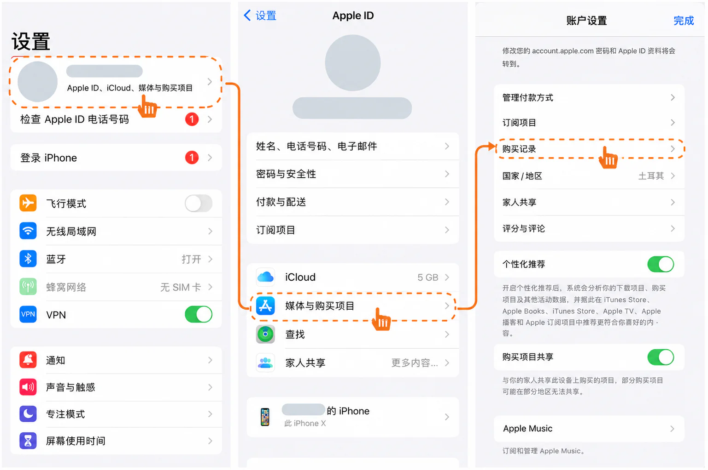

在选择 Apple ID 时的常见分类

在选择 Apple ID 时，很多用户都会发现市场上存在两种常见类型：

Apple ID 空白号
带消费记录的 Apple ID 号

而这些账号又可以进一步细分为新号与老号。（所以严格意义上有 4 种类型的划分）

带有以下标签的账号：

“带消费记录”
“已首充激活”
“高权重付费号”

其 Selling Price 往往会比普通空白号高出不少。

