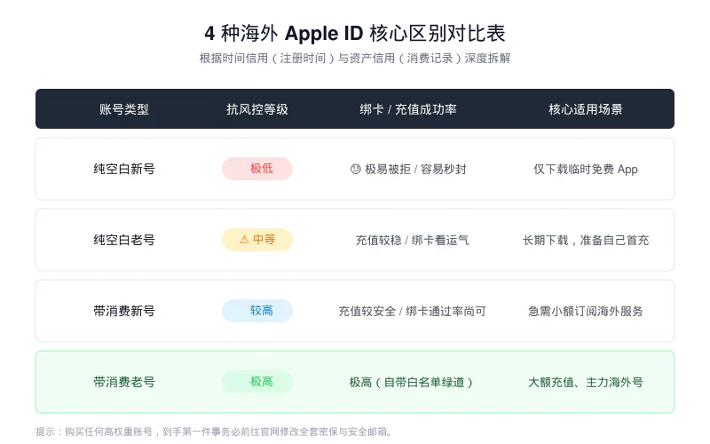
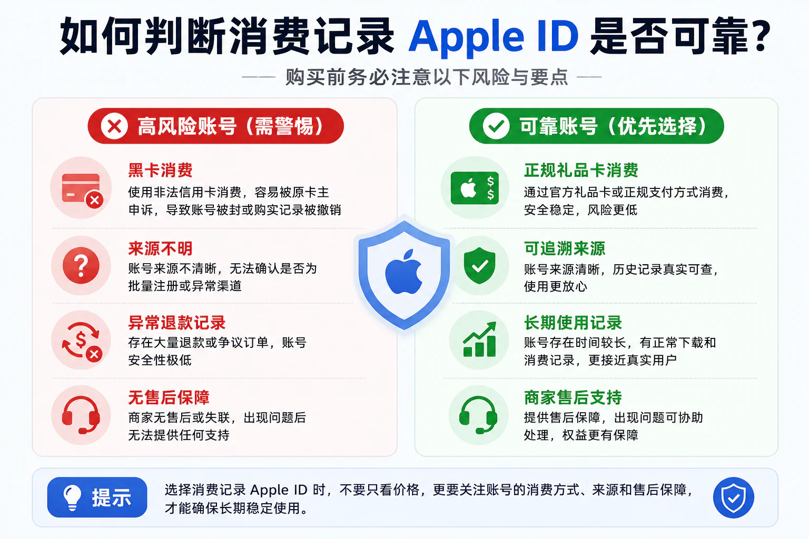

# 带消费记录的 Apple ID 有什么优势？为什么很多用户更愿意选择老号？

在选择 Apple ID 时，很多用户都会发现市场上存在两种常见类型：

- [Apple ID空白号](https://edigitalchoice.com/buy/5)
- [带消费记录的Apple ID号](https://accssupply.com/products/apple-id-with-purchase-history)

而这些账号又有新号与老号的区分。（严格来说可分为4种类型）

带有标签 **“带消费记录”、“已首充激活”、“高权重付费号”** 的账号，其 Selling Price 往往比普通空白号高出不少。

---

---

很多新手用户常会疑惑：

*“不就是下载个软件吗？多了几条消费记录，为什么价格差这么多？是不是营销噱头？”*

答案是：**并不完全是。**

在苹果的风控体系中，“有消费记录”和“零消费空白号”，在风险评估上可能属于不同等级。

对于部分用户来说，带消费记录 Apple ID 确实具备一些新号不具备的优势。

---

## 一、什么是带消费记录的 Apple ID？

简单来说：

带消费记录的Apple ID指的是曾经在App Store产生过付费消费行为的苹果账号。这种消费行为要么是通过绑定支付方式要么是通过充值礼品卡，在App 生态系统中至少成功购买过一次付费产品（哪怕只是一个 $0.99 的应用、或者是游戏内最低额度的内购充值）。

消费记录可能包括：

- App Store 应用购买  
- 游戏充值  
- Apple Music 订阅  
- iCloud+ 订阅  
- 影视内容购买  
- 礼品卡充值消费  

这些账号通常拥有一定使用历史，而不是纯“空白注册账号”。

---

---

## 二、带消费记录 Apple ID 的三大核心优势

### 优势一：极高风控免疫力（高权重）

从苹果风控角度来看，一个长期使用并有消费行为的账号，会形成更完整的用户画像，例如：

- 登录历史  
- 下载记录  
- 购买记录  
- 设备绑定记录  
- 地区使用记录  

相比刚注册的新账号，这类账号往往拥有更完整的使用轨迹。而在苹果的风控系统眼里， **“真金白银的消费”是洗脱机器人或恶意注册嫌疑的最强证明。**

黑产工作室和羊毛党为了控制成本，绝对不可能给批量注册的每一个账号都去真金白银地消费。因此，一旦账号有了真实的扣款历史，苹果就会判定这是一个“高价值的真实人类用户”。此时账号往往已经具备更完整的使用画像，在后续登录、设备切换或支付场景中，通常会比完全空白的新账号更稳定。

对于长期使用来说，部分用户会更倾向于选择这类历史记录较丰富的账号。

---

### 优势二：更容易建立长期使用环境

对于经常使用海外 Apple 服务的用户来说，账号历史记录会直接影响使用体验。

例如用户绑定：

- Visa / MasterCard  
- PayPal  
- 礼品卡余额  

用于订阅或购买服务。

但新号在首次绑定支付方式时，可能出现以下问题：

- 无法检查付款信息  
- 由于安全原因无法完成操作  
- 请联系 Apple 支持  
- 支付方式验证失败  

---

---

当然，这并不意味着所有新号都会失败，支付方式质量、IP环境、设备环境都会影响结果。

但总体来看，拥有消费记录的账号，其使用画像更完整。

在 [V2EX](https://v2ex.com/)、[Reddit](https://www.reddit.com/) 以及[Apple 社区](https://discussionschinese.apple.com/welcome)中，也能看到类似讨论。

长期经验表明： **历史正常的账号，支付成功率通常更高。**

---

 **推荐阅读**：

[苹果礼品卡消费异常问题解析](https://www.myggpark.com/digital-gift-cards/apple-gift-card/2522.html)

---

### 优势三：适合作为长期使用账号

新 Apple ID 更适合：

- 临时下载  
- 单次测试  
- 短期使用  

而带消费记录的 Apple ID 更适合：

- 长期使用  
- 持续下载应用  
- 保存购买记录  
- 多设备更新  

对于希望长期维护一个海外Apple ID的用户来说，老账号通常更具吸引力。

而一个已经存在多年并产生过正常消费行为的账号，本身就更接近真实用户的使用状态。

因此很多跨境从业者、开发者以及海外服务使用者，更愿意选择拥有一定 **[消费历史记录的Apple ID](https://accssupply.com/products/apple-id-with-purchase-history)**。

---

## 三、为什么消费记录是重要资产？

技术上可以批量“养号”，但无法轻易批量制造真实消费记录。

例如：

每个账号哪怕只消费 $1：

👉 1万个账号 = $10,000 成本

这意味着消费记录本身就是“成本门槛”。

苹果通过这种机制筛选真实用户。

当账号产生真实消费行为时，系统更倾向认为：

> 这是一个真实用户，而不是批量注册或脚本行为。

---

## 四、消费记录号使用避坑指南

### ❌ 1. 避免黑卡刷出来的消费记录

部分账号使用非法信用卡（黑卡）刷消费记录，这类账号风险极高：

- 可能被退款撤销记录  
- 可能被苹果冻结  
- 可能要求重新验证身份  

建议选择：

👉 正规礼品卡充值生成的账号  
👉 可长期稳定使用的账号  

---

### ❌ 2. 到手后必须及时修改安全信息

带消费记录账号价值较高，也更容易被盗用。

建议到手后尽快修改：

- 注册邮箱  
- 密保信息  
- 安全邮箱  
- 绑定手机号  

👉 建议 **一周内**完成调整，避免风控问题

 **【推荐阅读】**：

[手把手教你如何更改Apple ID密码/密保/个人资料](https://www.myggpark.com/apple-ecosystem/apple-id/1393.html)

---

## 五、常见问题 FAQ

### 1、带消费记录Apple ID 是否一定更安全？

并不存在绝对概念。

账号安全性更多取决于：

- 来源是否可靠  
- 是否及时修改密码  
- 是否开启双重验证  
- 是否规范使用  

---

### 2、带消费记录的Apple ID 是否一定是老号？

不一定。

有些账号虽然注册时间不长，但已经产生了消费行为。

因此“带消费记录”和“老号”并不能完全画等号。选择的时候，更推荐选择：

[带消费记录的老号](https://accssupply.com/products/apple-id-with-purchase-history)

---

### 3、带消费记录的Apple ID是否适合长期使用？

对于长期维护海外账号环境的用户来说，通常是比较受欢迎的选择。

---

### 4、带消费记录的Apple ID 值不值得多花钱购买？

如果只是：

- 下载一次应用  
- 临时测试  
- 短期体验  

那么：

[空白Apple ID老号](https://www.guokezhihui.com/buy/26)

通常已经足够。

如果你需要：

- 长期维护海外Apple ID  
- 绑定支付方式  
- 订阅海外服务  
- 持续更新应用  

那么带消费记录的账号往往更值得考虑。

账号本身的价值不仅在于一次消费记录，更在于它已经积累了一定的使用历史。

---

## 结语

空白Apple ID与带消费记录的Apple ID 并不存在绝对的好坏之分。

关键在于自己的使用需求。

如果只是短期下载应用，新账号通常已经足够；

如果希望长期维护海外 Apple ID 环境，拥有一定使用历史和消费记录的账号，则可能更符合长期使用需求。

根据自己的预算和实际用途进行选择，往往才是最合适的方案。

---

# 关于数智通

数智通专注于 AI 工具、海外账号、订阅支付与出海数字服务实战经验分享。

## 官方网站

* 出海研究站：https://www.myggpark.com
* 海外智选：https://www.accssupply.com
* 数字甄选：https://www.edigitalchoice.com
* 跨境严选：https://www.guokezhihui.com
* 跨境导航：https://www.kuajingchoice.com

## 社交媒体

* YouTube：https://www.youtube.com/@myggpark
* Bilibili：https://space.bilibili.com/3546696399194431

---

**本文首发于 [myggpark.com](https://www.myggpark.com/apple-ecosystem/apple-id/2956.html)，转载请注明出处。**

---

